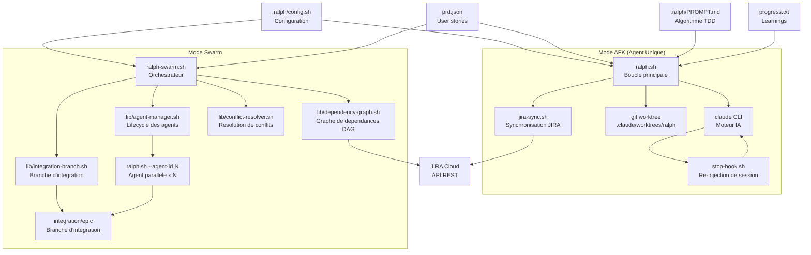
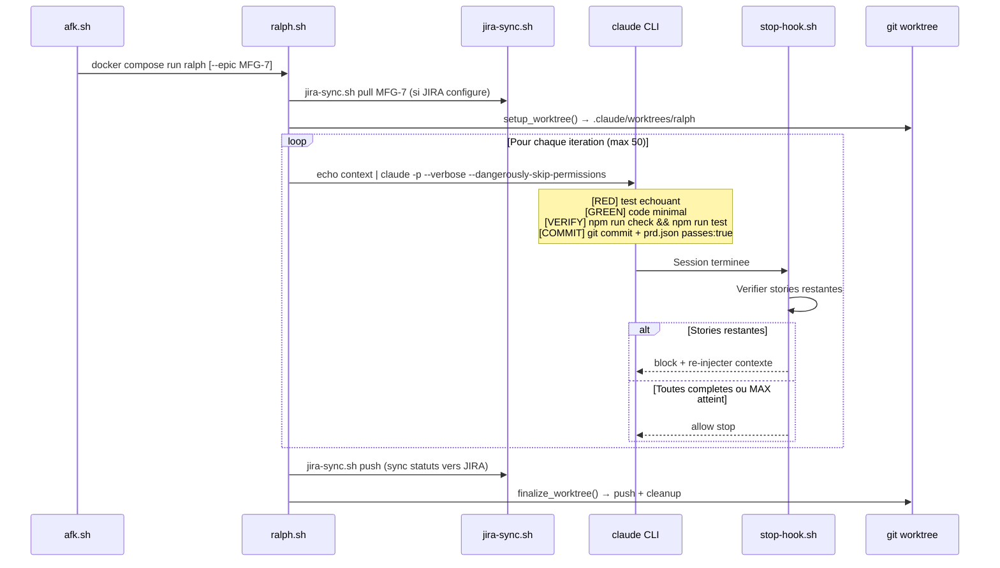
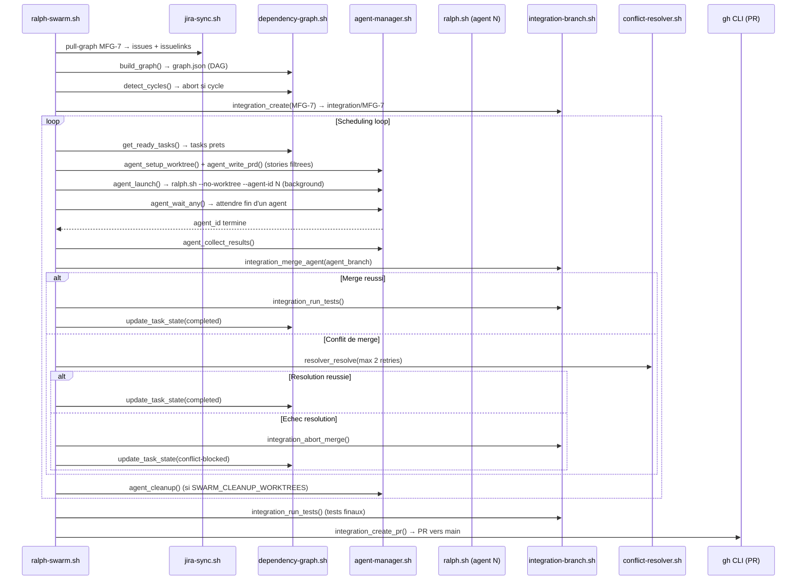
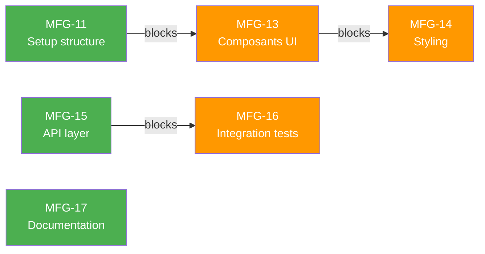

# Ralph Wiggum — Systeme de TDD Autonome

## 1. Objectifs du Systeme

Ralph Wiggum est un systeme de TDD (Test-Driven Development) autonome qui automatise le cycle de developpement. Il orchestre des sessions Claude Code CLI pour executer iterativement le cycle Red → Green → Refactor → Verify → Commit sur chaque user story definie dans `prd.json`.

L'objectif central est de rendre le developpement reproductible et non-supervisable : un developpeur peut confier un epic JIRA a Ralph et le retrouver avec du code valide, teste, commite et synchronise vers JIRA. Deux modes d'operation couvrent les cas d'usage de l'agent unique autonome au pipeline CI/CD multi-agents en parallele : AFK (agent unique) et Swarm (multi-agents paralleles).

Le flux de base est le suivant : `prd.json` definit les user stories → Ralph selectionne la premiere story incomplete → ecrit un test qui echoue → ecrit le code minimal → valide → commite → marque la story comme terminee → passe a la suivante.

---

## 2. Installation sur une Nouvelle Machine

### Prerequis

| Prerequis | Usage | Obligatoire |
|-----------|-------|-------------|
| Node.js 20+ | Runtime npm / Claude Code | Oui |
| npm | Gestionnaire de paquets | Oui |
| git | Gestion des worktrees et commits | Oui |
| jq | Traitement JSON (prd.json, graph.json) | Oui |
| Claude Code CLI | Moteur IA de Ralph | Oui |
| Docker | Isolation (AFK et Swarm) | Recommande |
| GitHub CLI `gh` | Creation de PR (Swarm) | Optionnel |
| Bun | Plugin claude-mem | Optionnel |

### Etapes d'installation

**1. Cloner le depot**
```bash
git clone <repo-url>
cd workshop-1
npm install
```

**2. Configurer les credentials Anthropic**
```bash
# Option 1: API key
export ANTHROPIC_API_KEY="sk-ant-..."

# Option 2: OAuth (abonnement Max/Pro)
claude auth login
```

**3. Configurer JIRA (optionnel)**

Creer le fichier `.env.ralph` a la racine du projet :
```bash
JIRA_BASE_URL=https://your-instance.atlassian.net
JIRA_EMAIL=your-email@example.com
JIRA_API_TOKEN=your-api-token
JIRA_PROJECT_KEY=PROJ
```
Obtenir un token API sur : https://id.atlassian.com/manage-profile/security/api-tokens

**4. Configurer `prd.json`**
```bash
# Depuis JIRA :
scripts/ralph/jira-sync.sh pull EPIC-KEY

# Ou manuellement depuis l'exemple :
cp .ralph/EXAMPLE.json prd.json
```

**5. Pour les modes Docker (AFK / Swarm)**
```bash
docker compose -f docker-compose.ralph.yml build
```

**6. Verifier l'installation**
```bash
claude --version
npm run check
npm run test
scripts/ralph/jira-sync.sh status
```

---

## 3. Architecture Systeme

### Vue d'ensemble



### Composantes du systeme

| Composant | Fichier | Role |
|-----------|---------|------|
| `ralph.sh` | `scripts/ralph/ralph.sh` | Boucle TDD principale, invoque Claude CLI, gere les worktrees |
| `stop-hook.sh` | `scripts/ralph/stop-hook.sh` | Hook de session Claude : re-injecte le contexte si une story reste incomplete |
| `jira-sync.sh` | `scripts/ralph/jira-sync.sh` | Synchronisation bidirectionnelle JIRA ↔ prd.json |
| `config.sh` | `.ralph/config.sh` | Configuration centrale (modes, chemins, flags) |
| `PROMPT.md` | `.ralph/PROMPT.md` | Algorithme TDD injecte dans chaque session Claude |
| `ralph-swarm.sh` | `scripts/ralph/ralph-swarm.sh` | Orchestrateur multi-agents, boucle de scheduling |
| `dependency-graph.sh` | `scripts/ralph/lib/dependency-graph.sh` | Construction du graphe DAG depuis JIRA issuelinks, tri topologique |
| `agent-manager.sh` | `scripts/ralph/lib/agent-manager.sh` | Lifecycle des agents (creation worktree, lancement, monitoring, cleanup) |
| `integration-branch.sh` | `scripts/ralph/lib/integration-branch.sh` | Gestion de la branche d'integration, merge, tests, creation de PR |
| `conflict-resolver.sh` | `scripts/ralph/lib/conflict-resolver.sh` | Resolution de conflits de merge via Claude (avec retry) |
| `afk.sh` | `scripts/ralph/afk.sh` | Wrapper Docker pour le mode AFK autonome |
| `swarm-afk.sh` | `scripts/ralph/swarm-afk.sh` | Wrapper Docker pour le mode Swarm |
| `init-firewall.sh` | `scripts/ralph/init-firewall.sh` | Securite reseau container (whitelist ufw) |
| `Dockerfile.ralph` | `Dockerfile.ralph` | Image Docker (Ubuntu 22.04 + Node.js 20 + Claude Code CLI) |
| `docker-compose.ralph.yml` | `docker-compose.ralph.yml` | Compose pour un agent unique (AFK) |
| `docker-compose.swarm.yml` | `docker-compose.swarm.yml` | Compose pour l'orchestrateur Swarm |

---

## 4. Modes d'Operation — Presentation Comparative

| Aspect | AFK | Swarm |
|--------|-----|-------|
| **Script principal** | `ralph.sh` (via `afk.sh`) | `ralph-swarm.sh` (via `swarm-afk.sh`) |
| **Interaction** | Entierement autonome | Entierement autonome + parallele |
| **Isolation** | Docker container (recommande) | Docker container (recommande) |
| **Parallelisme** | 1 agent | Jusqu'a N agents (defaut : 3) |
| **Permissions Claude** | `--dangerously-skip-permissions` | `--dangerously-skip-permissions` |
| **Max iterations** | 50 | Dependant du nombre de stories |
| **Synchronisation JIRA** | Optionnelle | Automatique (graphe de dependances) |
| **Branching git** | Worktree unique `ralph/{epic}` | Worktrees multiples + branche d'integration |
| **Strategie de merge** | Auto-push vers la branche | Auto-merge vers `integration/{epic}` + PR |
| **Resolution de conflits** | N/A (agent unique) | Automatisee via Claude resolver (max 2 retries) |
| **Reseau** | Firewall optionnel | Firewall optionnel |
| **Cas d'usage** | Stories independantes overnight | Epics entiers avec dependances |

---

## 5. Details de Chaque Mode avec Exemples

### Mode AFK (Away-From-Keyboard)

**Concept** : Ralph tourne de facon autonome dans un container Docker avec toutes les permissions accordees a Claude. Le container fournit l'isolation. Aucune interaction humaine requise. Peut tourner la nuit ou en CI.

**Detection automatique** : `config.sh` detecte la presence de `/.dockerenv` et bascule `MODE=AFK` avec `MAX_ITERATIONS=50`.

**Lancement**
```bash
# Via Docker (recommande)
scripts/ralph/afk.sh --epic MFG-7

# Direct (sans Docker — assurer l'isolation autrement)
scripts/ralph/ralph.sh --epic MFG-7
```

**Flux AFK**



**Quand l'utiliser** : stories independantes, processing nocturne, integration CI/CD.

---

### Mode Swarm (Multi-Agent Parallele)

**Concept** : Un orchestrateur lance plusieurs agents Ralph en parallele. Chaque agent travaille dans son propre git worktree sur un sous-ensemble de stories. Un graphe de dependances (construit depuis les `issuelinks` JIRA) garantit l'ordre d'execution. Une branche d'integration collecte le travail, avec resolution automatique des conflits.

**Lancement**
```bash
# Swarm complet
scripts/ralph/ralph-swarm.sh --epic MFG-7

# Dry-run (validation du graphe uniquement)
scripts/ralph/ralph-swarm.sh --epic MFG-7 --dry-run

# Sequentiel (un agent a la fois)
scripts/ralph/ralph-swarm.sh --epic MFG-7 --max-agents 1

# Via Docker
scripts/ralph/swarm-afk.sh --epic MFG-7

# Reprendre apres interruption
scripts/ralph/ralph-swarm.sh --epic MFG-7 --resume

# Sans JIRA (utiliser le prd.json existant)
scripts/ralph/ralph-swarm.sh --epic MFG-7 --no-jira
```

**Flux Swarm**



**Exemple de graphe de dependances**



Dans cet exemple, le Swarm identifie :
- **Chaine 1** : MFG-11 → MFG-13 → MFG-14 (un seul agent, en sequence)
- **Chaine 2** : MFG-15 → MFG-16 (un seul agent, en sequence)
- **Tache independante** : MFG-17 (agent parallele)

Avec `SWARM_ENABLE_CHAINING=true`, la chaine MFG-11/13/14 est confiee a un seul agent pour eviter les conflits inter-stories.

**Quand l'utiliser** : epics avec de nombreuses stories (5+), stories avec des chaines de dependances, maximisation du throughput.

---

## 6. Inventaire des Fichiers

| Fichier | Lignes | Role |
|---------|--------|------|
| `scripts/ralph/ralph.sh` | 433 | Boucle TDD principale, gestion worktree, invocation Claude |
| `scripts/ralph/ralph-swarm.sh` | 470 | Orchestrateur Swarm, boucle de scheduling, coordination |
| `scripts/ralph/stop-hook.sh` | 215 | Hook de continuation de session Claude |
| `scripts/ralph/jira-sync.sh` | 465 | Synchronisation bidirectionnelle JIRA ↔ prd.json |
| `scripts/ralph/afk.sh` | 24 | Wrapper Docker — mode AFK autonome |
| `scripts/ralph/swarm-afk.sh` | 67 | Wrapper Docker — mode Swarm |
| `scripts/ralph/init-firewall.sh` | 132 | Securite reseau container (whitelist ufw) |
| `scripts/ralph/lib/dependency-graph.sh` | 555 | Construction du graphe, tri topologique, groupement de chaines |
| `scripts/ralph/lib/agent-manager.sh` | 327 | Lifecycle des agents (creation, lancement, monitoring, cleanup) |
| `scripts/ralph/lib/integration-branch.sh` | 393 | Branche d'integration, merge, tests, creation de PR |
| `scripts/ralph/lib/conflict-resolver.sh` | 225 | Resolution de conflits de merge via Claude (retry) |
| `.ralph/config.sh` | 52 | Configuration centrale exportee vers tous les composants |
| `.ralph/PROMPT.md` | 89 | Algorithme TDD injecte dans chaque session Claude |
| `Dockerfile.ralph` | 72 | Image Docker (Ubuntu 22.04 + Node.js 20 + Claude Code CLI) |
| `docker-compose.ralph.yml` | 81 | Compose pour agent unique (AFK) |
| `docker-compose.swarm.yml` | 59 | Compose pour l'orchestrateur Swarm |
| `prd.json` | variable | Stories (fichier runtime, genere ou ecrit manuellement) |
| `progress.txt` | variable | Learnings accumules entre les iterations (fichier runtime) |
| `.env.ralph` | 4 | Credentials JIRA (non versionne, gitignore) |

---

## 7. Reference de Configuration

Toutes les variables sont definies dans `.ralph/config.sh` et exportees vers les processus enfants.

| Variable | Defaut | Description |
|----------|--------|-------------|
| `MAX_ITERATIONS` | `50` | Max iterations par run (override avec --max) |
| `SWARM_MAX_PARALLEL_AGENTS` | `3` | Max agents concurrents en mode Swarm |
| `SWARM_POLL_INTERVAL` | `10` | Secondes entre les verifications du statut des agents |
| `SWARM_MAX_CONFLICT_RETRIES` | `2` | Max tentatives de resolution par conflit |
| `SWARM_ENABLE_CHAINING` | `true` | Grouper les chaines lineaires pour un seul agent |
| `SWARM_CLEANUP_WORKTREES` | `true` | Supprimer les worktrees d'agents apres merge |
| `AUTO_FORMAT_ON_FAILURE` | `true` | Executer `npm run format` entre les iterations |
| `AUTO_LINT_FIX_ON_FAILURE` | `true` | Executer `npm run lint:fix` entre les iterations |
| `PROJECT_ROOT` | (auto-detecte) | Racine du depot git |
| `PRD_FILE` | `$PROJECT_ROOT/prd.json` | Fichier des stories |
| `PROGRESS_FILE` | `$PROJECT_ROOT/progress.txt` | Fichier de learnings |
| `RALPH_DIR` | `$PROJECT_ROOT/.ralph` | Repertoire de configuration |
| `SWARM_STATE_DIR` | `$PROJECT_ROOT/.ralph/swarm-state` | Etat runtime du Swarm (graph.json, agents.json, logs/) |

**Detection automatique du mode** : `config.sh` verifie la presence de `/.dockerenv` pour determiner `MODE=AFK`, ce qui fixe automatiquement `MAX_ITERATIONS`.

---

## 8. Reference des Commandes JIRA

| Commande | Description |
|----------|-------------|
| `jira-sync.sh pull <EPIC>` | JIRA → prd.json (stories "To Do" uniquement, preserve les `passes:true` existants) |
| `jira-sync.sh push` | prd.json → JIRA (transition les stories terminees vers "In Review") |
| `jira-sync.sh start <ISSUE>` | Transition vers "In Progress" + ajout du label "Ralph" |
| `jira-sync.sh complete <ISSUE>` | Transition vers "In Review" + ajout d'un commentaire |
| `jira-sync.sh pull-graph <EPIC>` | Recuperer le graphe de dependances (tous statuts + `issuelinks`) |
| `jira-sync.sh transitions <ISSUE>` | Lister les transitions disponibles (debugging) |
| `jira-sync.sh status` | Afficher l'etat de la configuration JIRA |

L'API JIRA utilisee est `/rest/api/3/search/jql` (POST) pour les recherches et `/rest/api/3/issue/{key}/transitions` pour les transitions. L'authentification est par Basic Auth (email + API token encode en base64).

---

## 9. Details d'Implementation

### Algorithme TDD de Ralph (PROMPT.md)

A chaque session, Claude recoit un contexte compose de :
1. Le contenu de `.ralph/PROMPT.md` (algorithme en 5 phases)
2. La story courante (id, title, type, description)
3. Les 30 dernières lignes de `progress.txt`
4. Les instructions pour la session

Claude est tenu de :
- Deleguer a `unit-test-writer` ou `e2e-test-writer` pour la phase RED
- Deleguer a `code-writer` pour la phase GREEN
- Deleguer a `architecture-reviewer` pour la phase REFACTOR (optionnel)
- Executer `npm run check && npm run test` pour la phase VERIFY
- Valider via **architecture-reviewer** que l'implementation couvre TOUS les criteres d'acceptance de la story (phase ACCEPT)
- Commiter avec le message `feat: [story-id] story title` et mettre `passes: true` dans `prd.json`

### Mecanisme du Stop Hook

`stop-hook.sh` est enregistre comme hook `Stop` de Claude Code. C'est un filet de securite pour la boucle en mode pipe : si Claude termine une story au sein d'une session et que la boucle externe n'a pas encore re-invoque, le hook intervient. A chaque fin de session, il :
1. Verifie que `RALPH_MODE=true` est present (evite d'interferer avec les sessions normales)
2. Cherche `<promise>COMPLETE</promise>` dans le dernier message de l'assistant
3. Verifie qu'il reste des stories incompletes dans `prd.json`
4. Verifie que le compteur d'iterations n'a pas depasse `MAX_ITERATIONS`
5. Si toutes les conditions sont reunies : retourne `{"decision": "block", "reason": "<contexte>"}` pour relancer Claude sur la prochaine story

### Gestion des Worktrees Git

Ralph cree un worktree isole pour travailler sans contaminer la branche principale :
- Mode AFK : `.claude/worktrees/ralph` sur la branche `ralph/{epic}`
- Mode Swarm : `.claude/worktrees/ralph-{agent_id}` sur la branche `ralph-swarm/{agent_id}`
- Branche d'integration Swarm : `.claude/worktrees/integration-{epic}` sur `integration/{epic}`

Les `node_modules` sont symlinkes depuis `PROJECT_ROOT` pour eviter de les reinstaller dans chaque worktree.

### Format du Graphe de Dependances (graph.json)

```json
{
  "nodes": {
    "MFG-11": {
      "summary": "Setup project structure",
      "status": "To Do",
      "blockedBy": [],
      "blocks": ["MFG-13"],
      "state": "pending"
    }
  },
  "ready": ["MFG-11", "MFG-17"],
  "chains": [["MFG-11", "MFG-13", "MFG-14"]]
}
```

Les etats possibles d'un noeud sont : `pending`, `in_progress`, `completed`, `failed`, `conflict-blocked`.

### Securite Reseau (init-firewall.sh)

En mode container, `init-firewall.sh` configure `ufw` pour autoriser uniquement les domaines necessaires :
- `api.anthropic.com` (Claude Code API)
- `github.com`, `api.github.com`, `raw.githubusercontent.com` (git, npm)
- `registry.npmjs.org` (packages)
- `*.atlassian.net` (JIRA)
- `api.context7.com` (optionnel, plugin context7)

Requiert la capability Docker `NET_ADMIN`. Par defaut, tout le trafic sortant est bloque.
