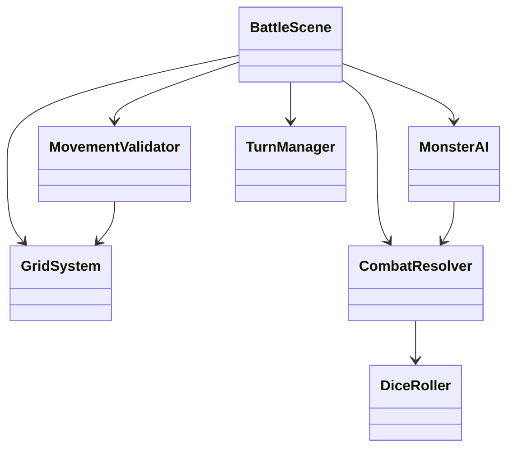

# TDD Refactoring Plan: BattleScene Decomposition

## Status: COMPLETED

All refactoring tasks have been completed successfully.

## Summary of Changes

### New Systems Created (4)
- **GridSystem** - Grid coordinate conversion, position validation
- **MovementValidator** - Movement validation logic with occupation checks
- **CombatResolver** - Attack resolution, damage calculation, range checking
- **MonsterAI** - Monster decision making (targeting, attack selection, movement)

### New Tests Added (42 scenarios)
- `features/unit/grid-system.feature` - 12 tests
- `features/unit/movement-validation.feature` - 10 tests
- `features/unit/combat-resolver.feature` - 10 tests
- `features/unit/monster-ai.feature` - 10 tests

### Code Quality Improvements
- **DiceRoller** - Extracted `parseDiceNotation()` to eliminate duplication
- **BattleScene** - Refactored to use new systems (569 lines, improved organization)
- **TurnManager** - Now used for `isPartyDefeated()` instead of inline logic

## Test Results

```
Unit/Integration Tests: 71 passed
E2E Tests: 8 passed
Total: 79 tests passing
```

## Architecture

```
src/
├── systems/
│   ├── GridSystem.ts        # Grid coordinate conversion
│   ├── MovementValidator.ts # Movement validation
│   ├── CombatResolver.ts    # Combat resolution
│   ├── MonsterAI.ts         # Monster AI decisions
│   ├── DiceRoller.ts        # Dice rolling (fixed duplication)
│   ├── TurnManager.ts       # Turn tracking
│   └── DataLoader.ts        # Data loading
├── entities/
│   └── Token.ts             # Token entities
└── scenes/
    └── BattleScene.ts       # Scene orchestrator using systems
```

### Dependency Graph



## Files Changed

### New Files
- `features/unit/grid-system.feature`
- `features/unit/movement-validation.feature`
- `features/unit/monster-ai.feature`
- `features/unit/combat-resolver.feature`
- `tests/steps/grid-system.steps.ts`
- `tests/steps/movement-validator.steps.ts`
- `tests/steps/monster-ai.steps.ts`
- `tests/steps/combat-resolver.steps.ts`
- `src/systems/GridSystem.ts`
- `src/systems/MovementValidator.ts`
- `src/systems/CombatResolver.ts`
- `src/systems/MonsterAI.ts`

### Modified Files
- `src/systems/DiceRoller.ts` - Fixed duplication with `parseDiceNotation()`
- `src/scenes/BattleScene.ts` - Refactored to use new systems
- `tests/steps/index.ts` - Import new step files
