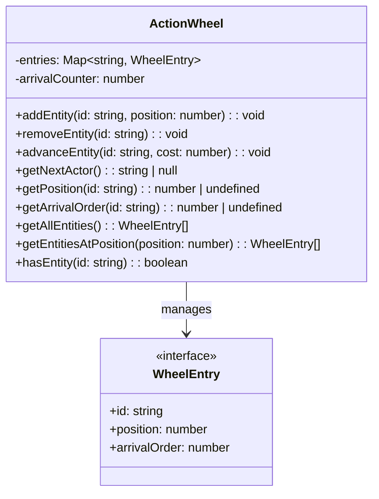
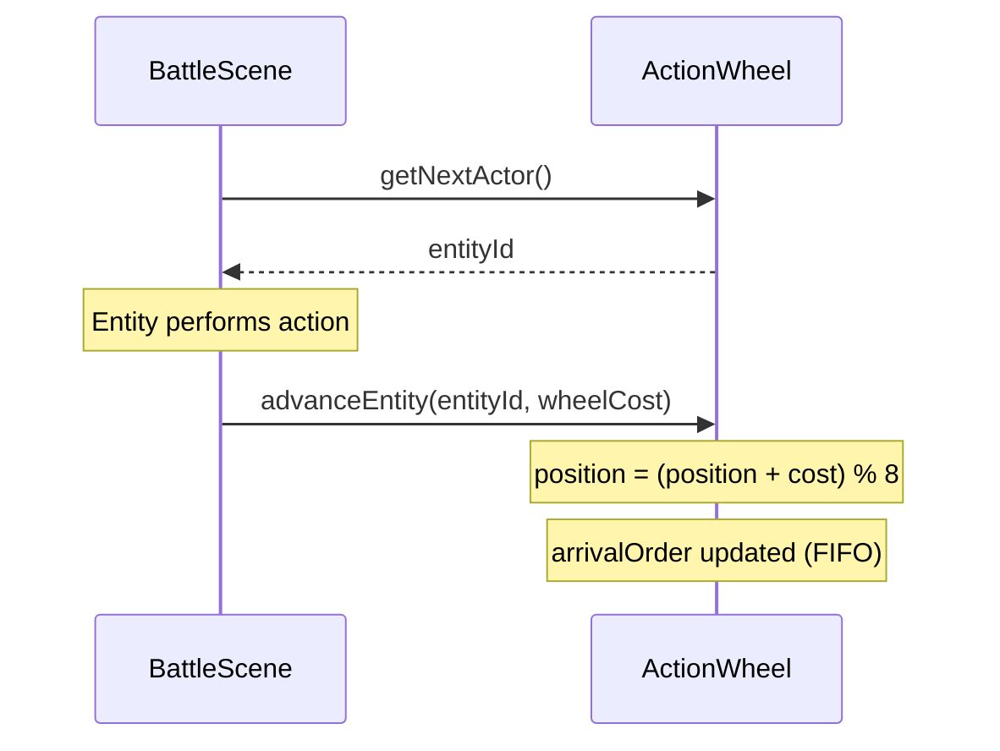
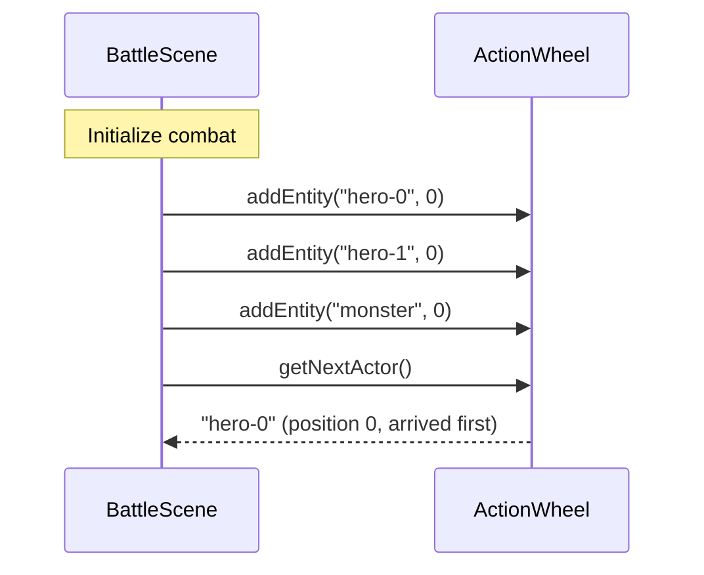

# Action Wheel

## Summary

The Action Wheel is an 8-segment circular system for tracking turn order. Creatures occupy positions 0-7, and the entity at the lowest position acts next. When multiple entities share a position, FIFO arrival order determines precedence. After acting, entities advance by the "wheel cost" of their action, wrapping around at 8.

## Component List

| Component | Responsibility |
|-----------|----------------|
| `ActionWheel` | Manages entity positions on the wheel and determines turn order |
| `WheelEntry` | Interface representing an entity's position and arrival order |

## Class Diagram

## Sequence Diagrams

### Turn Resolution

### Adding Entities at Battle Start

## Implementation Details

### Position Range
Positions are 0-7 (8 segments). Adding or advancing with values outside this range applies modulo 8.

### Tie-Breaking
When multiple entities share the same position, the one with the lowest `arrivalOrder` acts first (FIFO). After `advanceEntity()`, the entity's arrival order is updated to the current counter value, placing it behind any others at its new position.

### Entity Lifecycle
- `addEntity()` throws if the ID already exists
- `advanceEntity()` throws if the ID does not exist
- `removeEntity()` silently ignores non-existent IDs
