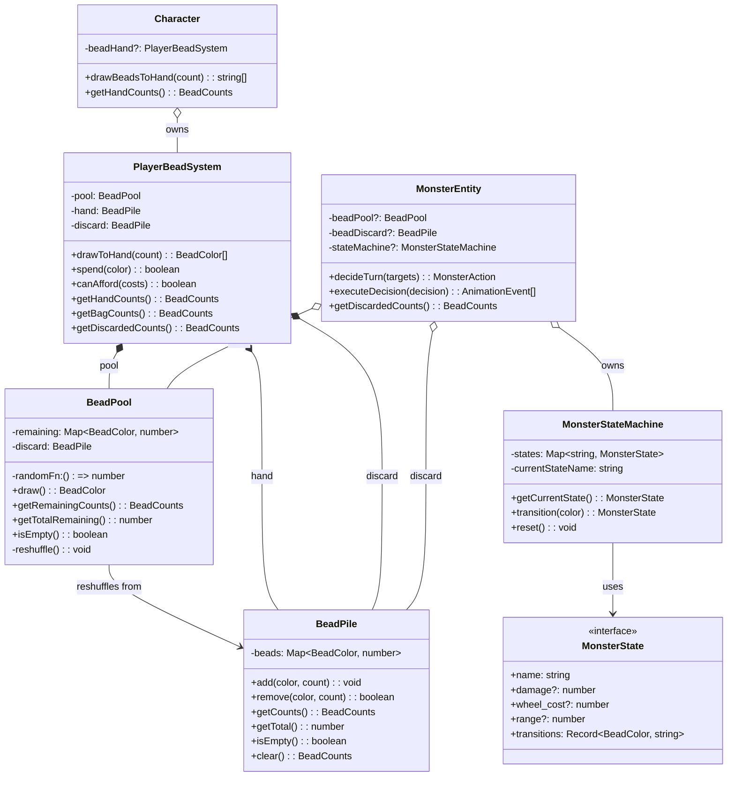
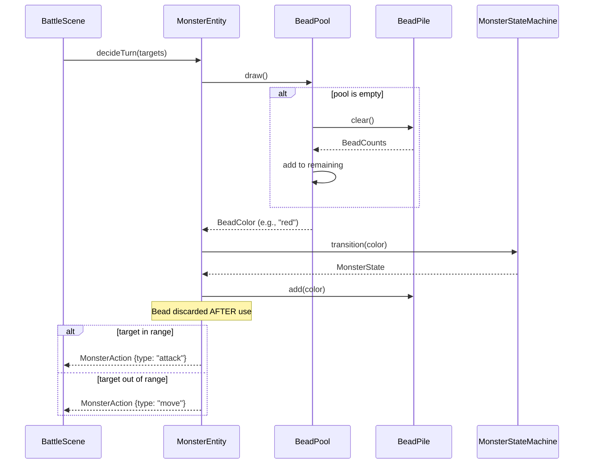
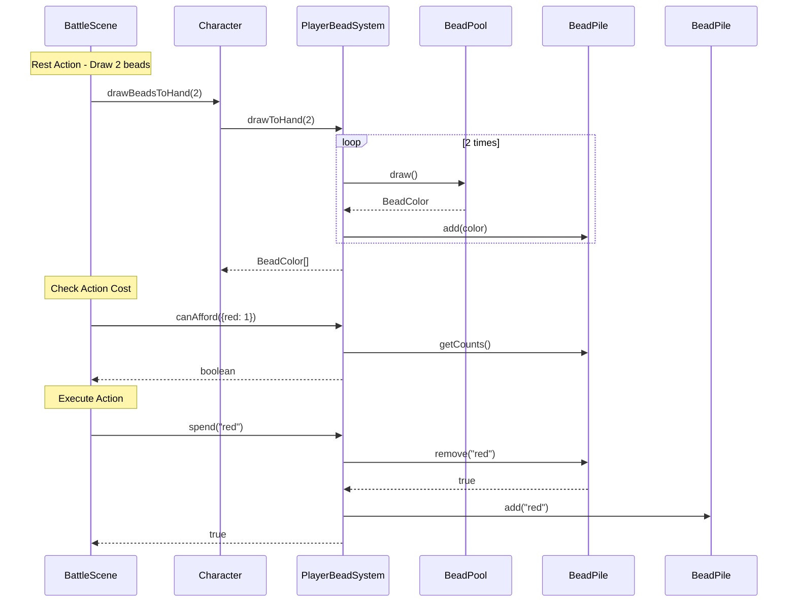

# Bead System

## Summary

The bead system provides resource management for both monsters and players through colored bead drawing.

**For monsters**: Beads drive a probabilistic state machine that determines monster actions. Players can track drawn beads to predict likely behaviors.

**For players**: Beads serve as action costs. Players draw beads to their hand and spend them to perform special actions.

Four bead colors exist: `red`, `blue`, `green`, `white`.

## Architecture

The bead system uses three composable abstractions:

```
Monster:                    Player:
┌──────────┐               ┌──────────┐
│ BeadPool │               │ BeadPool │
└────┬─────┘               └────┬─────┘
     │ draw()                   │ draw()
     ▼                          ▼
┌──────────┐               ┌──────────┐
│ BeadPile │               │ BeadPile │ (hand)
│ (discard)│               └────┬─────┘
└──────────┘                    │ spend()
     ↑                          ▼
     │ reshuffle()         ┌──────────┐
     └─────────────────────│ BeadPile │ (discard)
                           └──────────┘
```

**Key design**: `BeadPool.draw()` only removes from pool. It does NOT auto-discard. The consumer decides where the bead goes next.

## Component List

| Component | Responsibility |
|-----------|----------------|
| `BeadPile` | Simple bead collection with add/remove/clear operations |
| `BeadPool` | Draw bag that auto-reshuffles from linked discard pile when empty |
| `PlayerBeadSystem` | Composition of Pool → Hand → Discard for player bead management |
| `MonsterStateMachine` | Tracks monster current state, executes color-based transitions |
| `MonsterEntity` | Owns BeadPool + BeadPile + StateMachine, integrates AI via `decideTurn()` |
| `Character` | Owns PlayerBeadSystem instance for player characters |

## Class Diagram



## Sequence Diagrams

### Monster Turn (Bead-Based AI)



### Player Bead Usage



## Implementation Details

### Bead Colors

Four colors: `red`, `blue`, `green`, `white`. Types are defined in `src/types/Beads.ts`:

```typescript
type BeadColor = 'red' | 'blue' | 'green' | 'white';
type BeadCounts = { red: number; blue: number; green: number; white: number };
```

### BeadPile

A simple collection of beads. Used as a hand (beads available to spend) or discard pile.

```typescript
class BeadPile {
  add(color: BeadColor, count?: number): void
  remove(color: BeadColor, count?: number): boolean
  getCounts(): BeadCounts
  getTotal(): number
  isEmpty(): boolean
  clear(): BeadCounts  // removes all, returns what was there
}
```

### BeadPool

A bag you draw from. When empty, reshuffles from a linked discard pile.

```typescript
class BeadPool {
  constructor(initial: BeadCounts, discard: BeadPile, randomFn?)
  draw(): BeadColor           // auto-reshuffles if empty
  getRemainingCounts(): BeadCounts
  getTotalRemaining(): number
  isEmpty(): boolean
}
```

**Draw Mechanics:**
- Weighted random selection based on remaining counts
- Auto-reshuffle when pool empties (clears discard pile, adds to remaining)
- Does NOT add drawn bead to discard - consumer handles this

### PlayerBeadSystem

Composition of Pool → Hand → Discard for player bead management.

```typescript
class PlayerBeadSystem {
  drawToHand(count: number): BeadColor[]  // pool → hand
  spend(color: BeadColor): boolean        // hand → discard
  canAfford(costs: BeadCounts): boolean
  getHandCounts(): BeadCounts
  getBagCounts(): BeadCounts
  getDiscardedCounts(): BeadCounts
}
```

Default initialization: 3 of each color (12 beads total).

### Monster Bead Usage

Monsters use BeadPool + BeadPile directly (no wrapper class):

```typescript
// In MonsterEntity
private beadPool?: BeadPool;
private beadDiscard?: BeadPile;

decideTurn(targets: Entity[]): MonsterAction {
  const drawnBead = this.beadPool.draw();     // remove from pool
  const state = this.stateMachine.transition(drawnBead);  // use it
  this.beadDiscard.add(drawnBead);            // discard after use
  // ... targeting and action selection
}
```

This explicit flow allows the bead color to be used for state transition before being discarded.

### Monster State Definitions

States are defined in monster YAML with:
- `damage`, `wheel_cost`, `range`, `area` - action properties
- `transitions` - map of bead color to next state name

Example monster configuration:
```yaml
beads:
  red: 3
  blue: 2
  green: 2
  white: 1
start_state: idle
states:
  idle:
    transitions:
      red: attack
      blue: defend
      green: idle
      white: special
  attack:
    damage: 2
    wheel_cost: 3
    transitions:
      red: attack
      blue: idle
      green: idle
      white: special
```

### MonsterEntity.decideTurn()

The `decideTurn()` method encapsulates all AI logic:

1. Draw a bead from BeadPool
2. Transition the state machine based on bead color
3. Discard the bead after use
4. Find closest target using BattleGrid distance queries
5. If target is in range: return attack action
6. If target is out of range: calculate movement toward target
7. Return the action with drawn bead and state info for logging

This design keeps all AI decision-making within MonsterEntity, using BattleGrid for spatial queries.
