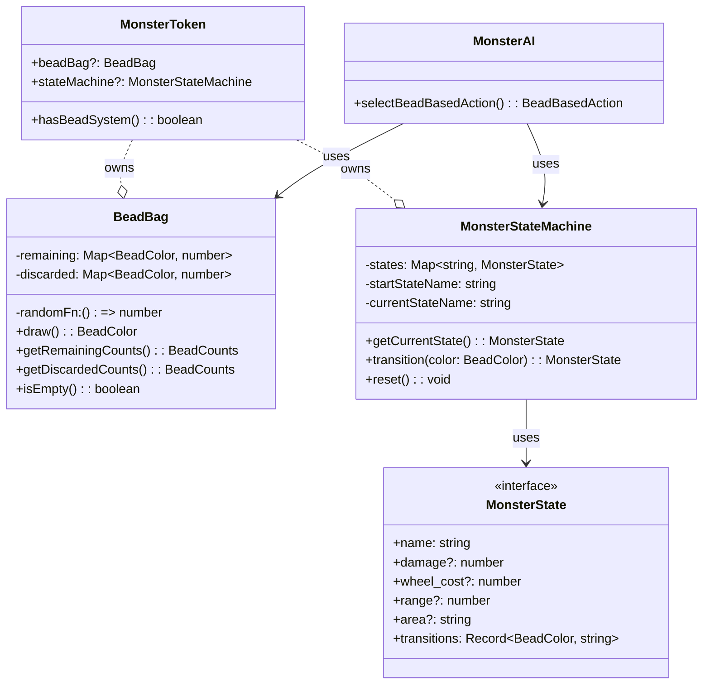
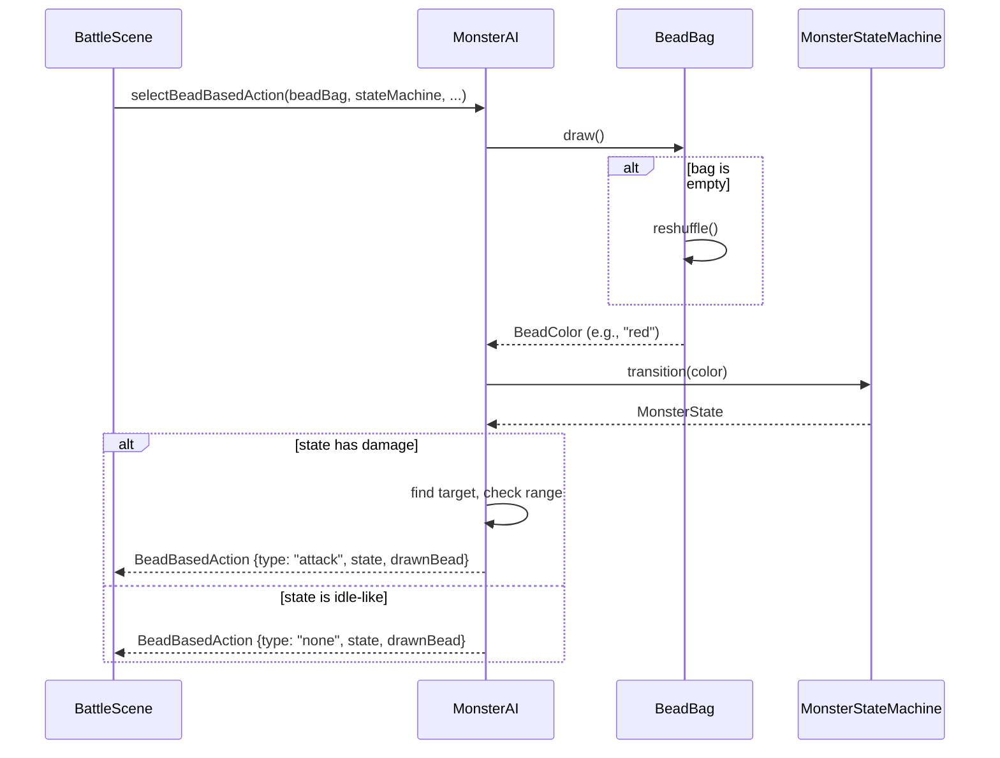

# Bead-Based Monster AI System

## Summary

The bead system provides probabilistic monster behavior through colored bead drawing. Monsters have a bag of beads and a state machine. Each turn, a bead is drawn and the color determines the state transition, which defines the monster's action.

This replaces deterministic AI patterns with a system that:
- Creates tension through visible probability (players can see remaining beads)
- Enables prediction without certainty
- Supports complex monster behaviors through state graphs

## Component List

| Component | Responsibility |
|-----------|----------------|
| `BeadBag` | Manages bead pool, handles drawing and auto-reshuffling when empty |
| `MonsterStateMachine` | Tracks current state, executes color-based transitions |
| `MonsterToken` | Owns BeadBag and StateMachine instances for bead-enabled monsters |
| `MonsterAI` | Coordinates bead draw with action selection via `selectBeadBasedAction()` |

## Class Diagram



## Sequence Diagram



## Implementation Details

### Bead Colors
Four colors: `red`, `blue`, `green`, `white`. Each monster defines how many of each color in their bag configuration.

### Draw Mechanics
- Weighted random selection based on remaining counts
- Drawn beads move to discard pile
- Auto-reshuffle when bag empties (all discards return to bag)

### State Definitions
States are defined in monster YAML with:
- `damage`, `wheel_cost`, `range`, `area` - action properties
- `transitions` - map of bead color to next state name

Example monster configuration:
```yaml
beads:
  red: 3
  blue: 2
  green: 2
  white: 1
start_state: idle
states:
  idle:
    transitions:
      red: attack
      blue: defend
      green: idle
      white: special
  attack:
    damage: 2
    wheel_cost: 3
    transitions:
      red: attack
      blue: idle
      green: idle
      white: special
```

### Integration
`MonsterToken.initializeBeadSystem()` creates BeadBag and StateMachine if monster data includes bead configuration. `hasBeadSystem()` checks availability before using bead-based AI.
