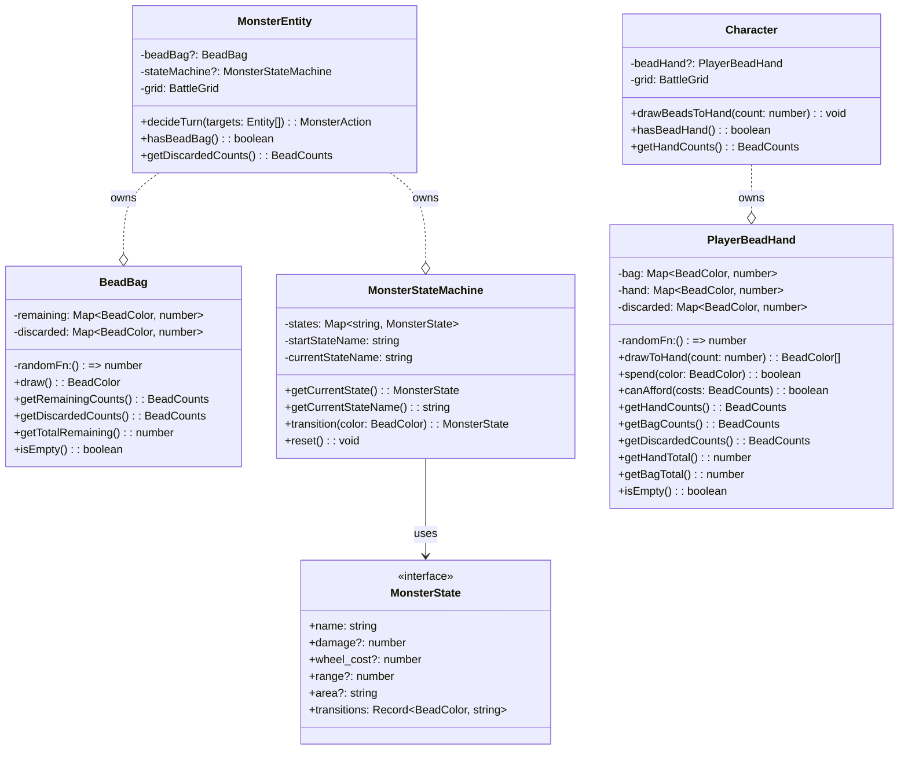
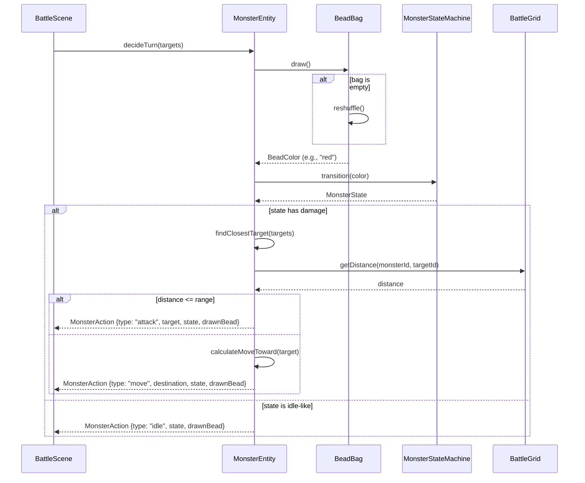
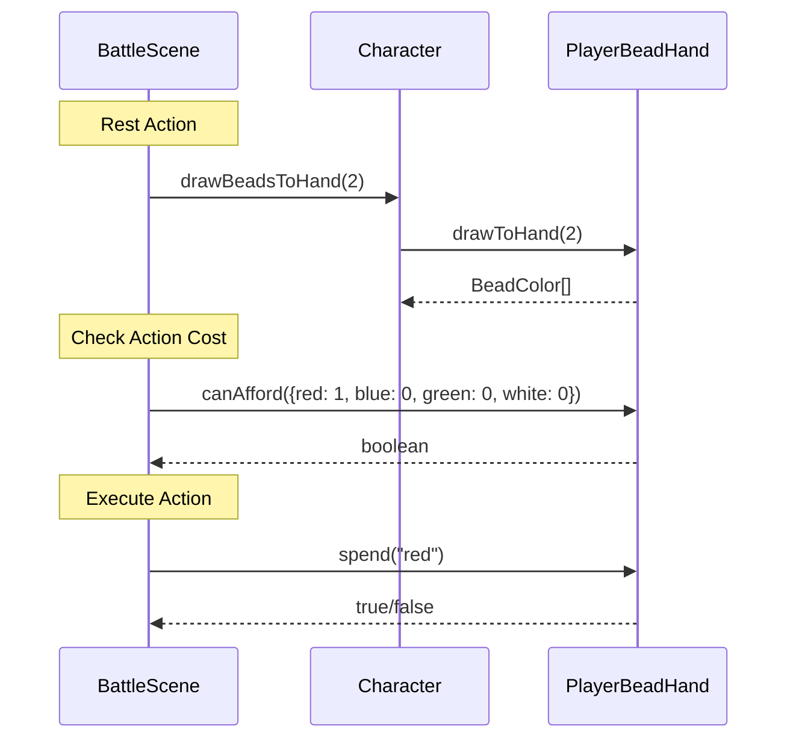

# Bead System

## Summary

The bead system provides resource management for both monsters and players through colored bead drawing.

**For monsters**: Beads drive a probabilistic state machine that determines monster actions. Players can track drawn beads to predict likely behaviors.

**For players**: Beads serve as action costs. Players draw beads to their hand and spend them to perform special actions.

Four bead colors exist: `red`, `blue`, `green`, `white`.

## Component List

| Component | Responsibility |
|-----------|----------------|
| `BeadBag` | Manages monster bead pool, handles drawing and auto-reshuffling when empty |
| `MonsterStateMachine` | Tracks monster current state, executes color-based transitions |
| `MonsterEntity` | Owns BeadBag and StateMachine, integrates AI via `decideTurn()` |
| `PlayerBeadHand` | Manages player bag, hand, and discard piles for action costs |
| `Character` | Owns PlayerBeadHand instance for player characters |

## Class Diagram



## Sequence Diagrams

### Monster Turn (Bead-Based AI)



### Player Bead Usage



## Implementation Details

### Bead Colors
Four colors: `red`, `blue`, `green`, `white`. Both monsters and players use the same `BeadColor` and `BeadCounts` types from `BeadBag.ts`.

### Monster Bead Bag

**Draw Mechanics:**
- Weighted random selection based on remaining counts
- Drawn beads move to discard pile
- Auto-reshuffle when bag empties (all discards return to bag)

**State Definitions:**
States are defined in monster YAML with:
- `damage`, `wheel_cost`, `range`, `area` - action properties
- `transitions` - map of bead color to next state name

Example monster configuration:
```yaml
beads:
  red: 3
  blue: 2
  green: 2
  white: 1
start_state: idle
states:
  idle:
    transitions:
      red: attack
      blue: defend
      green: idle
      white: special
  attack:
    damage: 2
    wheel_cost: 3
    transitions:
      red: attack
      blue: idle
      green: idle
      white: special
```

**Integration:**
`MonsterEntity.initializeBeadBag()` creates a BeadBag if monster data includes bead configuration. `MonsterEntity.initializeStateMachine()` creates the state machine. `hasBeadBag()` checks availability before using bead-based AI.

### Player Bead Hand

**Three Pools:**
- **Bag**: Source for drawing (default: 3 of each color = 12 beads)
- **Hand**: Beads available for spending on actions
- **Discard**: Spent beads, reshuffled back to bag when bag empties

**Key Operations:**
- `drawToHand(count)`: Moves N beads from bag to hand
- `spend(color)`: Moves specific bead from hand to discard
- `canAfford(costs)`: Checks if hand contains required beads

**Integration:**
`Character.initializeBeadHand()` creates a PlayerBeadHand with default bead counts. `hasBeadHand()` checks availability.

### MonsterEntity.decideTurn()

The `decideTurn()` method encapsulates all AI logic:

1. Draw a bead from BeadBag
2. Transition the state machine based on bead color
3. Find closest target using BattleGrid distance queries
4. If target is in range: return attack action
5. If target is out of range: calculate movement toward target
6. Return the action with drawn bead and state info for logging

This design keeps all AI decision-making within MonsterEntity, using BattleGrid for spatial queries.
