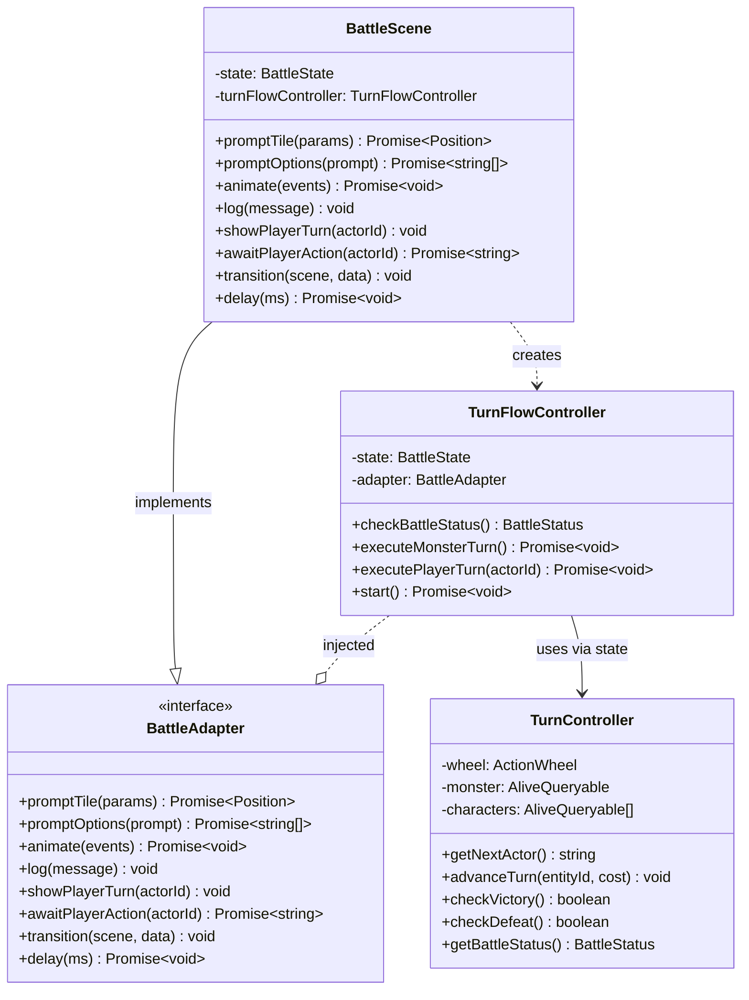
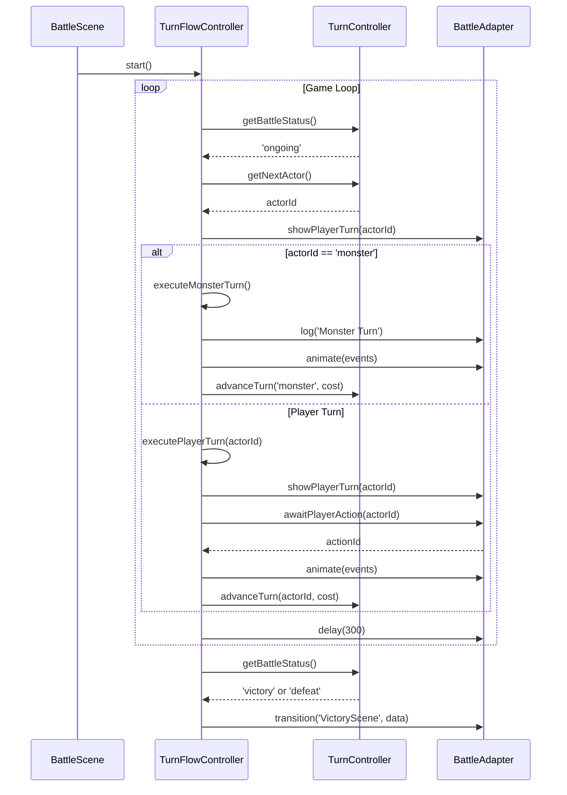

# Controller Architecture

## Summary

The controller architecture separates turn orchestration from Phaser UI via the Adapter pattern. `TurnFlowController` contains pure game loop logic with no Phaser dependencies, while `BattleScene` implements the `BattleAdapter` interface to handle UI operations.

This separation enables unit testing of turn logic without Phaser. Controllers receive state and adapter at construction, execute pure functions, and delegate all UI interactions through the adapter interface.

## Component List

| Component | Responsibility |
|-----------|----------------|
| `BattleAdapter` | Interface abstracting UI operations (prompts, animation, scene transitions) |
| `TurnFlowController` | Turn orchestration: game loop, victory/defeat detection, turn execution |
| `TurnController` | Wheel operations: get next actor, advance turns, status checks |
| `BattleScene` | Phaser adapter: implements BattleAdapter, delegates to TurnFlowController |

## Class Diagram



## Sequence Diagram



## Implementation Details

### Async Game Loop

`TurnFlowController.start()` uses an async while loop pattern:

```typescript
async start(): Promise<void> {
  while (true) {
    const status = this.checkBattleStatus();
    if (status !== 'ongoing') {
      this.adapter.transition('VictoryScene', { victory: status === 'victory' });
      return;
    }
    const actorId = this.state.turnController.getNextActor();

    if (actorId === 'monster') {
      await this.executeMonsterTurn();
    } else {
      await this.executePlayerTurn(actorId);
    }

    await this.adapter.delay(300);
  }
}
```

### Monster Turn Execution

`executeMonsterTurn()` follows a four-phase pattern:

1. **Decide**: Call `monster.decideTurn(targets)` to get AI decision
2. **Execute**: Call `monster.executeDecision(decision)` to apply state changes and collect events
3. **Animate**: Call `adapter.animate(events)` to play animations
4. **Advance**: Advance monster on wheel by decision's time cost

```typescript
async executeMonsterTurn(): Promise<void> {
  const monster = this.state.monster;
  const targets = this.state.characters.filter(c => c.isAlive());

  const decision = monster.decideTurn(targets);
  const events = monster.executeDecision(decision);

  await this.adapter.animate(events);
  this.state.turnController.advanceTurn('monster', decision.wheelCost);
  await this.adapter.delay(300);
}
```

### Player Turn Execution with Retry Loop

`executePlayerTurn()` handles action cancellation with a retry loop:

```typescript
async executePlayerTurn(actorId: string): Promise<void> {
  this.adapter.showPlayerTurn(actorId);

  while (true) {
    const actionId = await this.adapter.awaitPlayerAction(actorId);
    const action = this.actionRegistry.getAction(actionId);
    const resolution = action.resolve(actorId, this.adapter);
    const result = await resolution.execute();

    if (result.cancelled) {
      continue;  // Let player choose again
    }

    if (!result.success) {
      this.adapter.log(result.failureReason);
    }

    this.state.turnController.advanceTurn(actorId, result.cost.time);
    await this.adapter.delay(300);
    return;
  }
}
```

### BattleAdapter Method Reference

| Method | Purpose |
|--------|---------|
| `promptTile(params)` | Show targeting range, wait for tile click |
| `promptOptions(prompt)` | Show option panel, wait for selection |
| `animate(events)` | Play animation events via AnimationExecutor |
| `log(message)` | Write message to battle log |
| `showPlayerTurn(actorId)` | Auto-select actor, setup UI for turn |
| `awaitPlayerAction(actorId)` | Return Promise that resolves when action button clicked |
| `transition(scene, data)` | Switch to another Phaser scene |
| `delay(ms)` | Wait for specified milliseconds |

### File Locations

| File | Purpose |
|------|---------|
| `src/controllers/TurnFlowController.ts` | Turn orchestration logic |
| `src/types/BattleAdapter.ts` | Adapter interface definition |
| `src/systems/TurnController.ts` | Wheel and status operations |
| `src/scenes/BattleScene.ts` | Adapter implementation |
